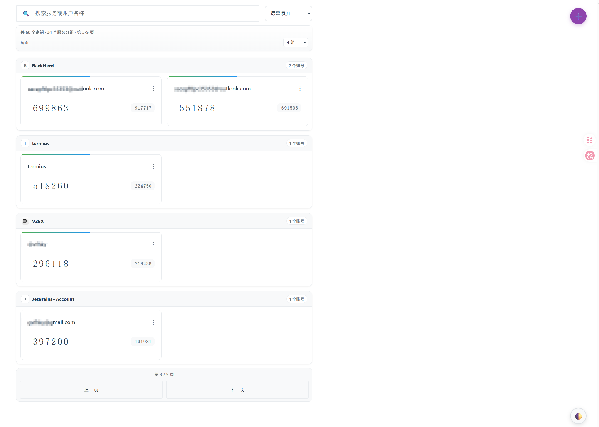
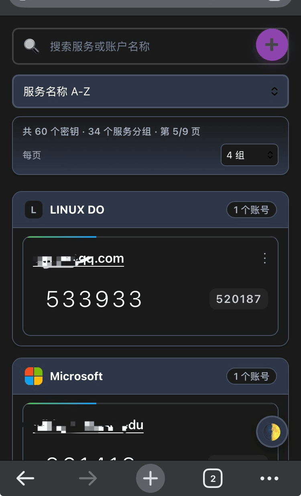

# 🔐 2FA

基于 Cloudflare Workers 的两步验证密钥管理系统。免费部署、全球加速、支持 PWA 离线使用。

**主要特性：** TOTP/HOTP 验证码自动生成 · 二维码扫描/图片识别添加密钥 · AES-GCM 256 位加密存储 · 从 Google Authenticator、Aegis、2FAS、Bitwarden 等应用批量导入 · 多格式导出（TXT/JSON/CSV/HTML/Google 迁移二维码） · 自动备份与还原 · 深色/浅色主题 · 响应式设计适配手机/平板/桌面

## 📸 截图预览

|                     桌面端                      |                    手机端                    |
| :---------------------------------------------: | :------------------------------------------: |
|  |  |

## 🚀 魔改的地方

项目clone自 [wuzf/2fa](https://github.com/wuzf/2fa) ，并做了如下魔改的地方

1. 支持分组展示，例如在RackNerd或者Google都有多个账号，那么所有的的账号都归类到RackNerd或者Google组下面
2. 优化了二维码扫码相关模块，提升二维码图片的识别率，避免从Google Authenticator等导出的二维码图片无法识别的问题
3. 数据报表统计
4. 支持分页查询、批量删除账号、批量删除备份的文件、分组自动icon、ui优化等等
5. 改进安全，例如手工退出登录、5分钟内管理员无活动则自动退出等等

### 一键部署（推荐）

1. 点击上方按钮，使用 GitHub 登录并授权
2. 登录 Cloudflare 账户，点击 **Deploy** 等待部署完成（KV 存储自动创建）
3. 打开 Cloudflare 给你的 Workers 链接，**设置管理密码**即可开始使用

## 🤝 参与贡献

欢迎提交 [Issue](https://github.com/vfhky/2fa/issues) 和 [Pull Request](https://github.com/vfhky/2fa/pulls)。开发相关请参考 [开发指南](docs/DEVELOPMENT.md)。

## 📄 许可证

[MIT License](LICENSE)

## 🌟 Star History

---
